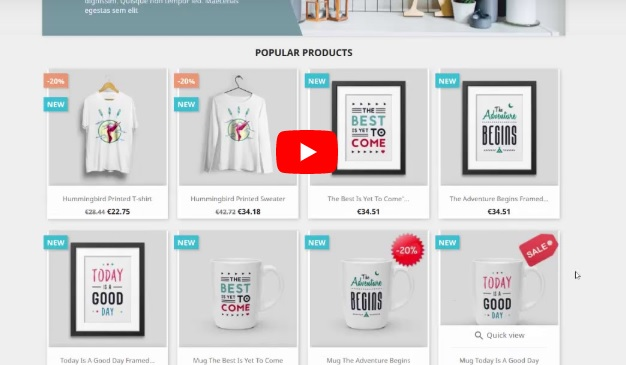

# Promotional Stickers Free module for Prestashop

Free module Promotional Stickers allows you to promote products by adding sticker on product cover image. Individual Sticker settings for each product. With the help of stickers you can pay attention of buyers to the promotional items.

## Main Features
* Individual sticker settings for specific product
* Uploading own stickers
* Text input for stickers
* Settings of size, position, text, font, text color
* Usage of additional fonts
* Easy management of Installed Stickers in Admin-Panel

Sticker on the cover product image will tell to the customers the important information you want to highlight. For example discount, free shipping, new arrivals etc.

## Installation
1.  Clone repository. Move `promostickers` directory to `module` dir.
3.  In your store's administration interface click on the "Modules" tab in the menu, find "Promotional Stickers" module, click "Install" and "Configure" then.

## Video overview

## Screenshots

